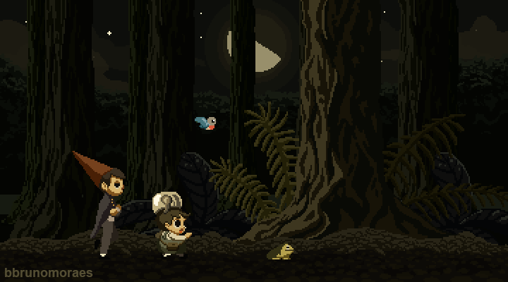
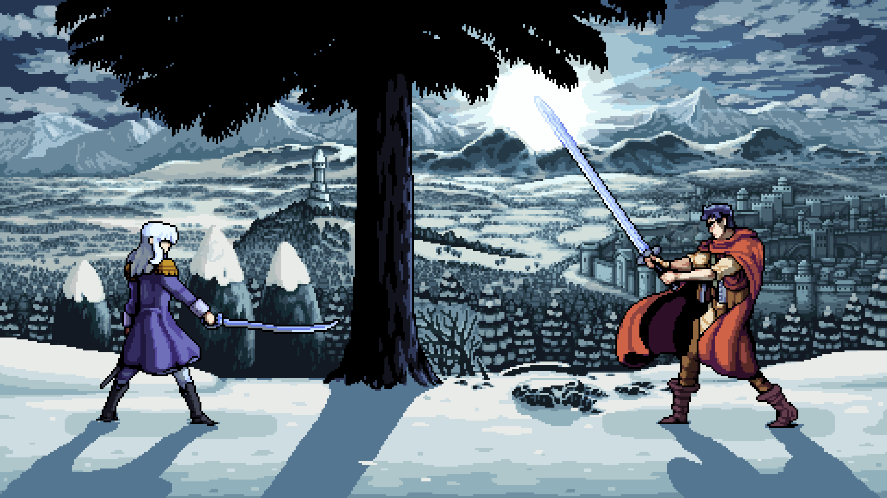
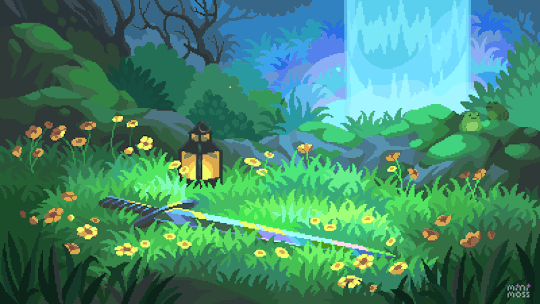

echo "# Trabalho2.0" >> README.md 
git init 
git add README.md 
git commit -m "primeiro commit" 
git branch -M main 
git remote add origin https://github.com/Apolo1Arthur/Trabalho2.0.git
 git push -u origin main

 <!DOCTYPE html><html lang="pt-br">
<head>
  <meta charset="UTF-8" />
  <meta name="viewport" content="width=device-width, initial-scale=1.0" />
  <title>Oprah Winfrey - Superação</title>
  
</head>
<body>
  

    
    
    
    
    
    

  <h1 id="titulo">Oprah Winfrey - Uma História de Superação</h1>
  

    Oprah nasceu em extrema pobreza, em uma área rural do Mississippi. Enfrentou abusos, discriminação e rejeição desde a infância. Ainda assim, transformou sua dor em força.
  

  <button onclick="proximoSlide()">Próximo</button>

  
<audio id="player"></audio>

  </body>
</html>
